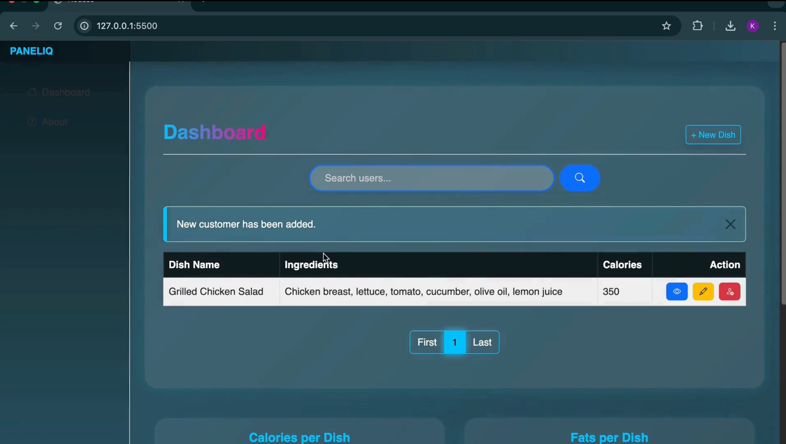
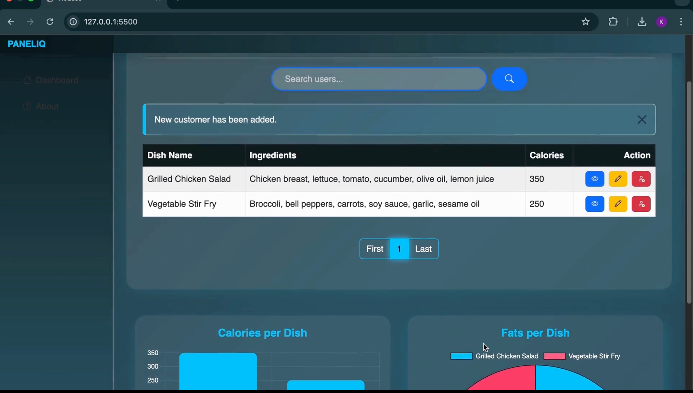

<h1 align="center">🥗 Eat. Log. Repeat</h1>
<p align="center">A secure, full-stack Calorie Tracker built with the MERN stack – track what you eat, securely and smartly!</p>

<p align="center">
  
  
  
  
</p>

---

## 📌 Overview

**Eat. Log. Repeat** is a modern, full-stack web application that allows users to securely log, track, and visualize their daily nutrition. Built with the **MERN** stack, it offers real-time data visualization, secure JWT authentication, and a clean, mobile-responsive UI.

---

## ✨ Key Features

- 🔐 **2-layer JWT Authentication** (Access + Refresh Tokens)
- 🔒 **Role-based Access Control** for advanced route protection
- 📈 **Nutrition Dashboard** with Pie Charts for Calories, Fat, Carbs, and Protein (powered by Chart.js)
- 📝 **Full CRUD Operations** for meals: add, edit, delete, and view logs
- ☁️ **MongoDB Atlas (v7.0, AWS-hosted)** for secure cloud storage
- 🌓 **Dark Mode Toggle** for better UX
- 📱 **Fully Responsive UI** – works across devices
- ⚙️ **Input validation, secure cookies, and sanitization** built-in
- 🚀 **CI/CD ready** with frontend & backend deploy configs (not live yet)

---

## 🧠 Learning Highlights

- Implemented **secure token handling** using refresh tokens with auto-expiry
- Designed **RESTful APIs** with Express and MongoDB aggregation pipelines
- Mastered **state management** in React using Context API
- Gained experience in deploying **cloud-hosted full-stack apps**

---

## 📸 Demo & Screenshots

> 🧪 This project is not deployed yet. You can run it locally using the steps below.  
> 📷 Below are some screenshots of the app interface:

<p align="center">
  
  <br><br>
  
  <br><br>
  
</p>

---

## 🔍 Tech Stack

| Category         | Tech                                |
|------------------|-------------------------------------|
| **Frontend**     | React.js, HTML5, CSS3, Chart.js     |
| **Backend**      | Node.js, Express.js                 |
| **Database**     | MongoDB 8 (via MongoDB Atlas)       |
| **Authentication** | JWT, bcrypt, Secure Cookies       |
| **Deployment**   | Vercel (Frontend), Render (Backend) |
| **Tools**        | Postman, Git, GitHub                |

---

## 📊 Dashboard Preview

- ✅ Interactive **Pie Charts** for fat, carbs, protein, and calories
- 🔄 Meal logs with timestamps, update/delete options
- 📆 Weekly/Monthly Stats View (planned)

---

## ⚙️ Getting Started

### 🖥️ Clone & Run Locally

```bash
git clone https://github.com/yourusername/eat-log-repeat.git
cd eat-log-repeat